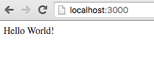

## Table of Contents

WIP

### Getting Started Tutorial

This tutorial will guide you through basics of `redux-elm` by implementing simple application and explaining concepts on top of that.

 TODO: describe the application

#### Necessary boilerplate
Before we get into coding let's start by cloning [https://github.com/salsita/redux-elm-skeleton](skeleton) project which will abstract away all the boilerplate needed for initializing modern ES2016/React/Webpack project. Throughout the code examples we'll probably not strictly use all the ES2016 features as it may be confusing for newcomers.

The directory structure of the skeleton project is fairly straightforward:

* `src` - Folder containing all your source files
  * `hello-world` - Our first `redux-elm` component, every component must expose two mandatory files: `updater` and `view`
    * `updater.js` - Elmish `updater` - we'll explain this later
    * `view.js` - React stateless Component
  * `boilerplate.js` - this file abstracts away all the boilerplate needed for using react/redux/redux-elm, it exports just single function, which we call `run`. You don't need to understand the code for now
  * `main.js` - your main file which uses function exposed from `boilerplate.js` and calls it with specific root component, which in our case is `hello-world`
* `index.html` - index file needed for displaying HTML
* `package.json` - dependencies description

You can try the [hello-world](https://github.com/salsita/redux-elm-skeleton/tree/master/src/hello-world) by simply running:

```javascript
npm install
npm start
```

`npm start` will start local HTTP server on port 3000 so you can't simply open your browser with http://localhost:3000 you should see following Hello World application:


which after clicking the button shows Hello World message



#### Hello World!

In `main.js` there's just one function `run` which starts the application.

```javascript
import run from './boilerplate';

import view from './hello-world/view';
import updater from './hello-world/updater';

run('app', view, updater);

```

`run` starts the application, we only need to provide **Root component** and every Elmish component consists of two parts **updater** and **view**. We call the component Root component because it's typical for Elmish architecture that application is modeled in form of component tree and every tree has its root. In our Hello World example we will have just one component therefore it's also Root component.

`run` takes three arguments:
- first argument is `id` attribute of HTML node we would like to mount the component in. In the example, its 'app' because there's `<div id="app"></div>` inside our `index.html`.
- second argument is `view` which is just plain old React component, it can be either `class` which `extends` from `Component` or a stateless function.
- third argument is `updater`, updater is very similiar to Redux reducer except it's not plain old JavaScript function but *it's generator* function.

Let's have a look at `view.js` inside `hello-world` repository:

```javascript
import React from 'react';

export default ({ model, dispatch }) => {
  if (model.greeted) {
    return <div>Hello World!</div>;
  } else {
    return <button onClick={() => dispatch({ type: 'SayHi' })}>Say Hi</button>;
  }
};

```

There's basically nothing special about View, it's just a stateless function which conditionally returns either Greeting or Button. Every View gets at least two mandatory `props`:
1. `dispatch` - this is a plain old Redux dispatch function, we can use this function for dispatching an action
2. `model` - This is a model for specific View, based on the model we can render some markup. In other words (mathematical words) View is function of Model. **You can only query the model in View, all mutations happens in Updater**.

Think of your View as a declarative definition of how the HTML markup should look like based on the state of Model.

Trickier part is Updater.

```javascript
import { Updater, Matchers } from 'redux-elm';

const initialModel = {
  greeted: false
};

export default new Updater(initialModel, Matchers.exactMatcher)
  .case('SayHi', function*() {
    return {
      greeted: true
    };
  })
  .toReducer();
```

For now think about your Updater as series of functions which gets applied onto Model whenever an action matches provided pattern.

When implementing Updater there are two conditions which every Updater must meet:

1. Every Updater must be provided with initial Model. Initial Model is first argument of the `Updater` constructor, the argument can be basically any type (except Function, only Generator Function is allowed) you can think of: String, Object, Number
2. Every Updater must be converted to Reducer by calling `toReducer()` method on the Updater instance.

Please ignore the second argument of `Updater` constructor now, we'll explain this in following chapters, for now you always use `Matchers.exactMatcher` import from `redux-elm` package.

Updater in its simplest form could look like this:

```javascript
export default new Updater(0)
  .toReducer();
```

However, this updater is not really handy because it does not define any mutations on the model, its Model consist of Integer with its initial value 0. If you have used this as Root Updater with following Root View:

```javascript
export default ({ model, dispatch }) => <div>{model}</div>;
```

Then you'd see only 0 on the screen because it's initial value of the model and we've defined this in our Updater.

