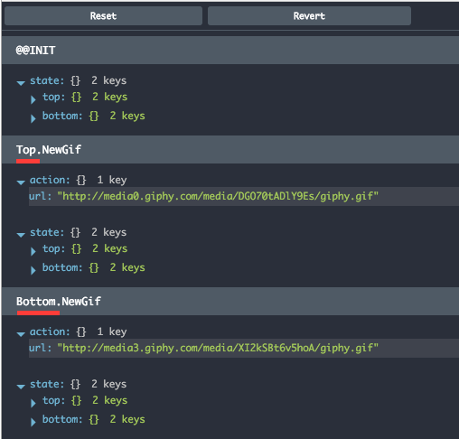

## Action Composition in Practice

You might have spotted one problem with our current implementation: both `init` functions yield a Side Effect which resolves into a newly dispatched `NewGif` Action. How can our application know which `NewGif` Action belongs to which instance of the `GifViewer` Component (Top or Bottom)? This is where Action composition comes in! We need to turn:

```javascript
{
  type: 'NewGif',
  url: 'http://media3.giphy....'
}
```

into:

```javascript
{
  type: 'Top.NewGif', // or type: 'Bottom.NewGif'
  url: 'http://media3.giphy....'
}
```

This is easy with `redux-elm` because it exposes a `mapEffects` function that does exactly what we need. You can wrap the Updater (or `init` function) with the `mapEffects` function, and all the dispatched Actions within yielded Side Effects will be automatically wrapped by a parent Action. In this specific case all the `dispatched` Actions in the embeded `GifViewer` Component will be "tagged" with `Top` or `Bottom`.

```javascript
import { Updater, mapEffects } from 'redux-elm';

import { init as gifViewerInit } from '../gif-viewer/updater';

const funnyCatsGifViewerInit = gifViewerInit('funny cats');
const funnyDogsGifViewerInit = gifViewerInit('funny dogs');

export function* init() {
  return {
    top: yield* mapEffects(funnyCatsGifViewerInit(), 'Top'),
    bottom: yield* mapEffects(funnyDogsGifViewerInit(), 'Bottom')
  };
};

export default new Updater(init).toReducer();

```

After running the application, you should now be able to see the composed Actions in [`redux-devtools-extension`](https://github.com/zalmoxisus/redux-devtools-extension).

