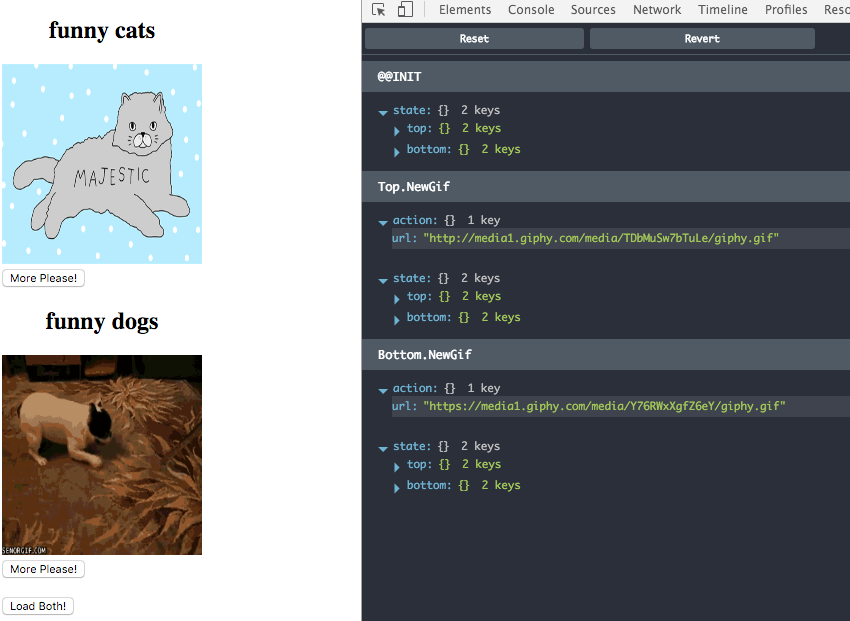

## Action Composition in Practice

The reason why nothing really works yet is that we haven't plugged in the `GifViewer` Updater yet. So we know how Action Composition works so how does it look in `redux-elm`?

### Wrapping Action

Let's have a look at `GifViewerPair` View:

```javascript
import React from 'react';
import { view } from 'redux-elm';

import GifViewer from '../gif-viewer/view';

export default view(({ model, dispatch }) => (
  <div>
    <GifViewer model={model.top} dispatch={dispatch} />
    <GifViewer model={model.bottom} dispatch={dispatch} />
    <br />
    <button onClick={() => dispatch({ type: 'Load' })}>Load Both!</button>
  </div>
));
```

The idea is simple, any nested Component should get modified version of dispatch which tags all the outgoing actions. `redux-elm` provides function `forwardTo` which takes original dispatch as first argument and all the other arguments defines composition chain.

Therefore calling `dispatch({ type: 'Foo' })` will dispatch `Foo` but using `forwardTo` allows us to do something like this:

```javascript
import { view, forwardTo } from 'redux-elm';

export default view(({ model, dispatch }) => {
  const wrappedDispatch = forwardTo(dispatch, 'ActionPrefix');
  return <button onClick={() => wrappedDispatch({ type: 'Foo' })}>Click Me</button>
});
```

After clicking the `Button` action with type `ActionPrefix.Foo` is dispatched, we can utilize this and tag all the outgoing actions in nested components by `Top` or `Bottom`:

```javascript
import React from 'react';
import { forwardTo, view } from 'redux-elm';

import GifViewer from '../gif-viewer/view';

export default view(({ model, dispatch }) => (
  <div>
    <GifViewer model={model.top} dispatch={forwardTo(dispatch, 'Top')} />
    <GifViewer model={model.bottom} dispatch={forwardTo(dispatch, 'Bottom')} />
    <br />
    <button onClick={() => dispatch({ type: 'Load' })}>Load Both!</button>
  </div>
));
```

### Unwrapping Action

Now, any action dispatched within nested component will be automatically tagged, we call this concept action wrapping. But when you wrap something, you also need to be able to unwrap it and that's what `redux-elm` is doing automatically for you when handling Action in Updater.

```javascript
import { Updater } from 'redux-elm';

import gifViewerUpdater, { init as gifViewerInit } from '../gif-viewer/updater';

const initialModel = {
  top: gifViewerInit('funny cats'),
  bottom: gifViewerInit('funny dogs')
};

export default new Updater(initialModel)
  .case('Top', (model, action) =>
    ({ ...model, top: gifViewerUpdater(model.top, action) }))
  .case('Bottom', (model, action, ...rest) =>
    ({ ...model, bottom: gifViewerUpdater(model.bottom, action) }))
  .toReducer();
```

`redux-elm` is smart enough to automatically determine if the Action needs to be unwrapped and unwraps it automatically, therefore any action tagged by `Top` or `Bottom` is automatically unwrapped and passed as argument to the function. For instance action `Top.NewGif` will jump into the `Top` handler and action argument will be of type `NewGif`, `GifViewer` Updater will get unwrapped action.

This is a great Composition and Encapsulation example, `GifViewerPair` Updater knows that it holds two `GifViewer`s but it doesn't know anything about their internal implementation, what it does it just unwraps the action and passes it to corresponding Updater. 

Imagine our `GifViewerPair` Updater as a person who unwraps a package which may contain another package, and if so hands it over to another person (the `GifViewer` Updater) who is responsible for handling the contents of the package. Keep in mind that the package can be wrapped many times for many people (Component Updaters), with each one handing off to the person "below" them. The Composition part is the hierarchy while Encapsulation is nobody knowing the contents of the package which is not addressed directly to then.

Let's compile and run the Application and see the result:



### What about Sagas?

Since Sagas are technically part of the Updater, you don't need to worry about wrapping or unwrapping Actions for Sagas, everything works automatically and framework takes care of it. Keep in mind that any Action going into Saga is automatically unwrapped and any outgoing action is automatically wrapped. Actions lives in local context of the Updater, same applies for `select` Effect in Saga, it will always get local slice of application state, which in `redux-elm` terms means Component's Model.
