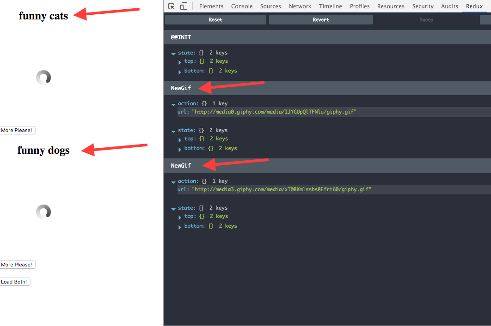

## Updater Composition

The reason why nothing really works yet is that we haven't plugged in the `GifViewer` Updater yet. We also need to initialize the child Models properly by turning our initial Model into a function:

```javascript
import { Updater } from 'redux-elm';

import { init as gifViewerInit } from '../gif-viewer/updater';

const funnyCatsGifViewerInit = gifViewerInit('funny cats');
const funnyDogsGifViewerInit = gifViewerInit('funny dogs');

export function* init() {
  return {
    top: yield* funnyCatsGifViewerInit(),
    bottom: yield* funnyDogsGifViewerInit()
  };
};

export default new Updater(init).toReducer();

```

We know that the  `init` function exposed by `GifViewer` is a thunk (function that returns a function). We therefore need to call it *twice* to invoke it. The first call takes one argument, which is the topic for the `GifViewer`, and returns the function which can be later used (without parameters) to initialize the Model. We'll use cats for the top `GifViewer` and dogs for bottom. Hypothetically the app should now correctly show the topic above the `GifViewer` and trigger the initial API call.

You might have spotted the `yield*` keyword. This is essential because Generators do not automatically propagate up the call hierarchy, so you need to explicitly say that you want to propagate `yield`s. Therefore, anytime you call a generator function in your Updater, don't forget to prepend the `yield*` keyword.

**Remember: use `yield*` whenever you want to call a sub-Updater and use `yield` whenever you want to return a side effect**



You can see from the screenshot that we have two `GifViewer` topics and two corresponding API calls.

### Redux DevTools Extension
Are you wondering what is the intriguing browser extension on the right side of the above the screenshot? It's [`redux-devtools-extension`](https://github.com/zalmoxisus/redux-devtools-extension), which allows you to debug your Redux applications. You should check it out.

Note that `redux-elm-skeleton` already integrates Redux DevTools, so you just need to [install the extension](https://chrome.google.com/webstore/detail/redux-devtools/lmhkpmbekcpmknklioeibfkpmmfibljd) in your browser and restart it, and you'll should see the Redux tab in your Chrome Dev Tools view.
