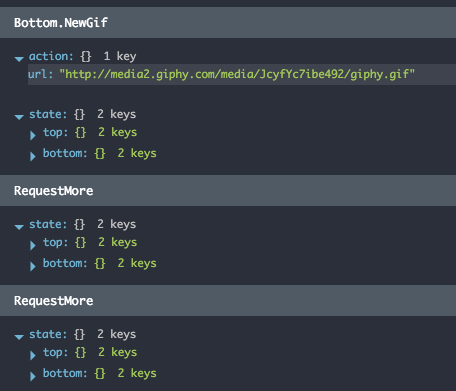

## Using Matchers

Let's see how these different Matcher types are used in practice.

We need to proxy all Actions tagged with `Top` or `Bottom` to the `GifViewer` Updater, which mutates the state and potentially emits Side Effects. Imagine our `GifViewerPair` Updater as a person who unwraps a package which may contain another package, and if so hands it over to another person (the `GifViewer` Updater) who is responsible for handling the contents of the package. Keep in mind that the package can be wrapped many times for many people (Component Updaters), with each one handing off to the person "below" them.

We need to strip `Top.` or `Bottom.` off the beginning of the Action type and provide rest to the underlying Child Updater as unwrapped Action:

```javascript
import { Updater, mapEffects } from 'redux-elm';

import gifViewerUpdater, { init as gifViewerInit } from '../gif-viewer/updater';

const funnyCatsGifViewerInit = gifViewerInit('funny cats');
const funnyDogsGifViewerInit = gifViewerInit('funny dogs');

export function* init() {
  return {
    top: yield* mapEffects(funnyCatsGifViewerInit(), 'Top'),
    bottom: yield* mapEffects(funnyDogsGifViewerInit(), 'Bottom')
  };
};

export default new Updater(init)
  .case('Top', function*(model, action) {
    return {
      ...model,
      top: yield* mapEffects(gifViewerUpdater(model.top, action), 'Top')
    };
  })
  .case('Bottom', function*(model, action) {
    return {
      ...model,
      bottom: yield* mapEffects(gifViewerUpdater(model.bottom, action), 'Bottom')
    };
  })
  .toReducer();

```

We've basically implemented the behavior of people unwrapping packages and handing them off to someone else. The `GifViewerPair` Updater just takes any Action starting with `Top` or `Bottom`, unwraps its contents and passes them to the `GifViewer` Updater along with the corresponding Model slice.

We must not forget `mapEffects` because handling that Action in `GifViewer` Updater may potentially dispatch another Action. In this case we would need to "wrap" it back so that when it gets back to the Updater loop, the Action type contains all the necessary segments starting from the top of the Updater hierarchy. So if the `Top` Component dispatches a `Foo` Action, `mapEffects` makes sure the Action type is wrapped so that it is `Top.Foo` and not just `Foo`.

Let's compile and run the Application and see the result:


When you click the "More Please!"" button on either Viewer, nothing happens. Here's why:



The `RequestMore` Action is not wrapped. We need to make one small adjustment to `GifViewerPair`:

```javascript
import React from 'react';

import GifViewer from '../gif-viewer/view';

export default ({ model, dispatch }) => (
  <div>
    <GifViewer model={model.top} dispatch={dispatch} />
    <GifViewer model={model.bottom} dispatch={dispatch} />
    <br />
    <button onClick={() => dispatch({ type: 'Load' })}>Load Both!</button>
  </div>
);

```

The `dispatch` function passed to the child View instance should automatically tag all the Actions with the `Top` or `Bottom` prefix (i.e. wrap the action). This is exactly the same thing we did in our Updater using the `mapEffects` function.

`redux-elm` provides a function to do this automatically for you. `forwardTo` takes the `dispatch` function as its first argument and an arbitrary number of additional string arguments that define how Actions dispatched by that function should be wrapped:

```javascript
import React from 'react';
import { forwardTo } from 'redux-elm';

import GifViewer from '../gif-viewer/view';

export default ({ model, dispatch }) => (
  <div>
    <GifViewer model={model.top} dispatch={forwardTo(dispatch, 'Top')} />
    <GifViewer model={model.bottom} dispatch={forwardTo(dispatch, 'Bottom')} />
    <br />
    <button onClick={() => dispatch({ type: 'Load' })}>Load Both!</button>
  </div>
);
```

Save and hit the Refresh button. Voilà! Now the "More Please!" button works as expected.
